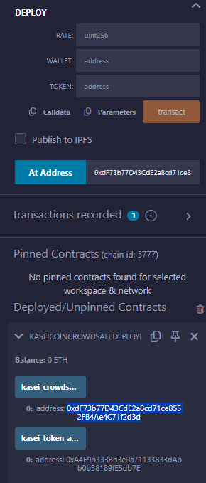

# mars_monetary_system

## Deployment Instructions

### Once Compiled navigate to the 'Deplot & run transactions' button on the left side of the screen. On the 'ENVIRONMENT' drop down select 'Injected Provider - MetaMask' then select the account you would like to use to deplaoy the contract on the 'ACCOUNT' drop down. Select the 'KaseiCoinCowdsaleDeployer' contract from the CONTRACT' dropdown.

###  Click the grey drop down arrow to the right of the orange 'Deploy' button, then input the 'NAME:' and 'SYMBOL:' of the coin. Copy the 'ACCOUNT' that you selected in the first step by clicking the small grey copy button next to the 'ACCOUNT' then paste it into the 'WALLET:' input section under 'DEPLOY'. Finally, click 'transact'

### MetaMask will automatically open at which point you will select 'Confirm' to confirm the transaction

### Once deployed we can view the Token and Crowdsale addresses by clicking on them after selecting the grey drop down next to the deployed contract.

### Select the KaseiCoin contract in the ‘CONTRACT’ dropdown, you will copy the ‘kasei_token_address’ from the bottom of the page and paste it in the ‘At Address’ box. Click ‘At Address’

### Select the KaseiCoinCrowdsale contract in the ‘CONTRACT’ dropdown, you will copy the ‘kasei_crowdsale_address’ from the bottom of the page and paste it in the ‘At Address’ box. Click ‘At Address’

### Select a different ‘ACCOUNT’ and select the ‘VALUE’ of Wei they would like to purchase, then select the Crowdsale contract at the bottom, and click ‘transact’. MetaMask will automatically open at which point you will select 'Confirm' to confirm the transaction

### Navigate to the token contract and the bottom and select ‘totalsupply’ to view the total amount of tokens.

### ### Navigate to the crowdsale contract and the bottom and select ‘weiRaised’ to view the total wei raised.

## Evaluation Evidence

### KaseiCoin Compiled

### KaseiCoinCrowdsale Compiled

### Ganach Transactions

